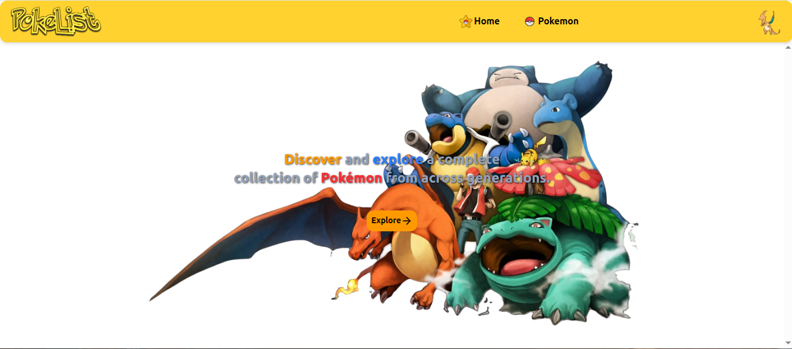
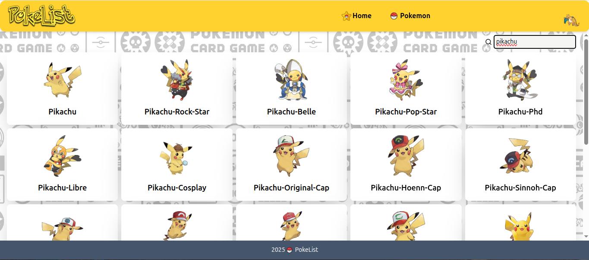
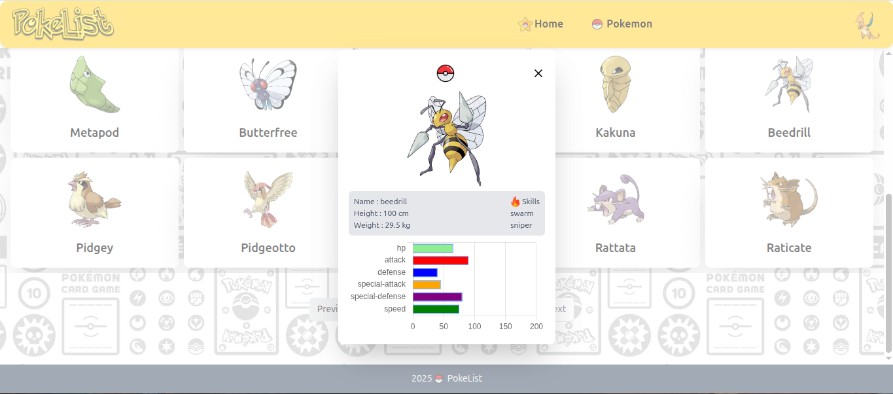

# PokeList

## How to Install

- create env file
- fill in the env file like .env.example
- add the url value with public pokemon api
```
VITE_API_URL_POKEMON=https://pokeapi.co/api/v2/pokemon
```

**Terminal**
```
npm install
```

```
npm run dev
```

## Stack
- React js
- React Hook
- React Router
- Tailwind CSS
- Chart JS

## Screenshot
### Homepage


### Pokemon List Page


### Detail Pokemon

